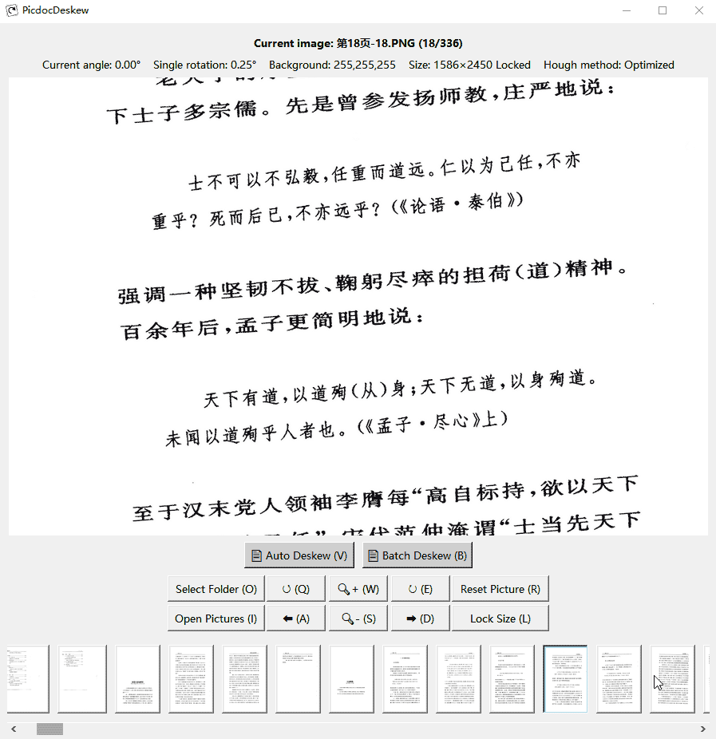
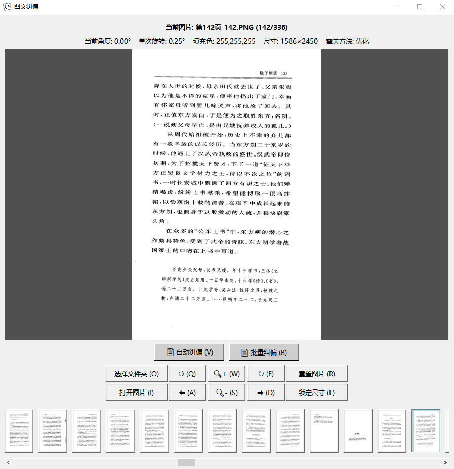

#  图文纠偏 - 图片文档纠偏工具

集成了两点调平方法和经典的霍夫变换方法，能够方便准确地纠正倾斜的图片文档。

## 核心功能

**手动纠偏** - 提供两点纠偏功能，通过选择两个参考点快速校正水平或垂直线条。

**自动纠偏** - 采用优化的霍夫变换算法，自动检测并校正图片中的文本行角度，支持三种检测模式。

**批量处理** - 可对整个文件夹的图片进行批量自动纠偏，支持从当前图片开始处理。

## 特色功能

- **尺寸锁定**：旋转后自动裁切回原始尺寸，避免图片尺寸变化
- **背景色提取**：提取屏幕任意位置颜色作为旋转图像时的填充色
- **支持透明图片**：保留透明通道，并提供透明填充
- **参考线辅助**：光标参考线便于观察倾斜角度
- **自动保存**：切换图片时自动以无损格式保存到同目录Deskew文件夹
- **多语言支持**：界面支持中英文切换，自动识别系统语言

## 使用方式

### 运行 
   1. 根据系统要求安装 Python 并添加好环境变量；
   2. 安装所有依赖；
      `pip install -r requirements.txt`
   3. 下载文件后设置 .py 文件的 “打开方式” 为 Python 解释器；
   4. 双击运行 PicdocDeskew.py 文件。

### 准备（手动或自动都需要）
   1. 拖拽图片或文件夹载入图片；
   2. 设置好填充色（P 键拾取光标处的颜色）用以填充图片旋转后多出的背景（默认白色）；
   3. 按需开启锁定尺寸，旋转图片后自动裁切回原始尺寸，避免图片尺寸变化（默认关闭）。
   
### 手动操作
   该工具是为了纠正倾斜的文档图片而开发，为了提高手动操作的效率，做了如下设计：
   1. 切换图片会同时保存图片，省去了重复地打开、保存和关闭；
   2. 单手操作：Q/E 键控制左右旋转、A/D 键切换前后图片并保存；
   3. 对于倾斜角度小的图，单次旋转角度默认 0.25 度（可设置），按几下 Q/E 键就能调正；
   4. 对于倾斜角度大的图，鼠标在图片上点击倾斜的两个点就能将其瞬间调正；

### 自动纠偏
   使用霍夫方法自动识别文档倾斜角度，再进行两点调正计算，实现自动纠偏：
   1. 点击按钮**自动纠偏**当前图片；
   2. 点击按钮从**当前**图片开始**批量纠偏**直到图片列表的最后一张，再次点击（或按Esc键）可中断；

## 系统要求

支持 Windows、macOS 和 Linux 系统，需要 Python 3.7+ 环境。依赖的库有 numpy、Pillow、OpenCV 和 tkinterdnd2（可选），首次运行将自动检测并提示安装缺失依赖。

### 许可证
本项目采用 [MIT 许可证](LICENSE) 开源，版权所有 © 2025 distinctive-mark。  
允许自由使用、复制、修改、合并、发布、分发、再许可及出售软件副本，前提是保留原始版权声明与许可声明。  
完整许可条款详见项目根目录下的 [LICENSE](LICENSE) 文件。

